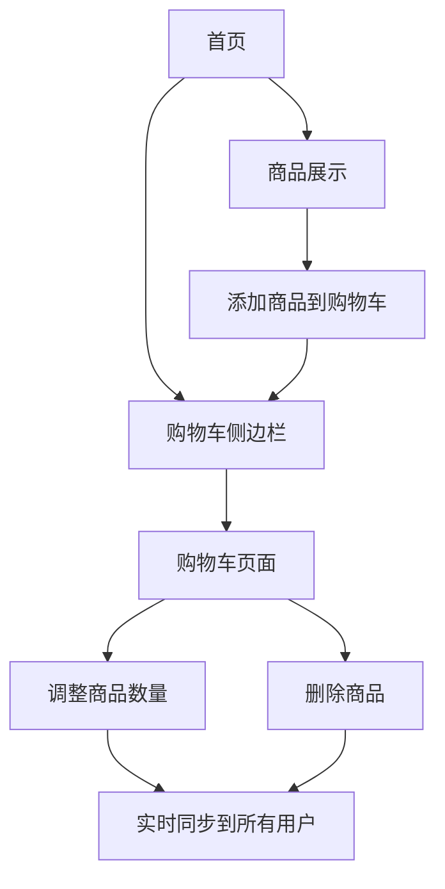

# WebSocket购物车实时同步Demo - 产品需求文档

## 1. Product Overview
基于WebSocket技术实现的多用户购物车实时同步演示项目，用于学习和掌握WebSocket实时通信技术。
- 解决多用户同时操作购物车时的数据同步问题，提供流畅的实时协作体验。
- 面向想要学习WebSocket技术的开发者，展示实时通信在电商场景中的实际应用。

## 2. Core Features

### 2.1 User Roles
本项目为学习演示项目，不区分用户角色，所有用户具有相同权限。

### 2.2 Feature Module
我们的WebSocket购物车demo包含以下主要页面：
1. **首页**: 商品展示区域、购物车侧边栏、在线用户列表
2. **购物车页面**: 购物车商品列表、数量调整、删除操作、实时同步状态显示

### 2.3 Page Details

| Page Name | Module Name | Feature description |
|-----------|-------------|---------------------|
| 首页 | 商品展示区 | 展示可购买商品列表，包含商品图片、名称、价格、添加到购物车按钮 |
| 首页 | 购物车侧边栏 | 显示当前购物车商品数量、总价、快速查看购物车内容 |
| 首页 | 在线用户列表 | 实时显示当前在线用户数量和用户标识，展示WebSocket连接状态 |
| 购物车页面 | 商品列表 | 显示购物车内所有商品，包含商品信息、数量、小计价格 |
| 购物车页面 | 数量调整 | 增加/减少商品数量，实时同步到所有用户，支持输入框直接修改 |
| 购物车页面 | 删除操作 | 从购物车移除商品，操作实时同步到所有连接的用户 |
| 购物车页面 | 同步状态显示 | 显示实时同步状态、最后操作用户、操作时间等信息 |

## 3. Core Process

**主要用户操作流程：**
1. 用户访问首页，自动建立WebSocket连接
2. 浏览商品列表，点击添加商品到购物车
3. 查看购物车侧边栏或进入购物车页面
4. 在购物车页面调整商品数量或删除商品
5. 所有操作实时同步到其他在线用户
6. 用户可以看到其他用户的操作和当前购物车状态

## 4. User Interface Design

### 4.1 Design Style
- **主色调**: 蓝色系 (#2563eb) 和白色 (#ffffff)
- **辅助色**: 灰色 (#6b7280)、绿色 (#10b981) 用于成功状态、红色 (#ef4444) 用于删除操作
- **按钮样式**: 圆角按钮，hover效果，主要按钮使用蓝色背景
- **字体**: 系统默认字体，标题16px，正文14px，小字12px
- **布局风格**: 卡片式布局，顶部导航栏，响应式设计
- **图标风格**: 简洁的线性图标，购物车、用户、加减号等

### 4.2 Page Design Overview

| Page Name | Module Name | UI Elements |
|-----------|-------------|-------------|
| 首页 | 商品展示区 | 网格布局的商品卡片，每个卡片包含图片、标题、价格、添加按钮，hover效果 |
| 首页 | 购物车侧边栏 | 固定在右侧的滑出面板，显示购物车图标、商品数量徽章、总价 |
| 首页 | 在线用户列表 | 顶部状态栏显示在线用户数，绿色圆点表示连接状态 |
| 购物车页面 | 商品列表 | 表格或列表形式，每行包含商品信息、数量调整器、删除按钮 |
| 购物车页面 | 数量调整 | 减号按钮、数字输入框、加号按钮的组合，带有加载状态 |
| 购物车页面 | 同步状态显示 | 底部状态栏，显示最后更新时间、操作用户、连接状态指示器 |

### 4.3 Responsiveness
桌面优先设计，支持移动端适配。购物车侧边栏在移动端转为底部抽屉式设计，商品网格在小屏幕上调整为单列布局。