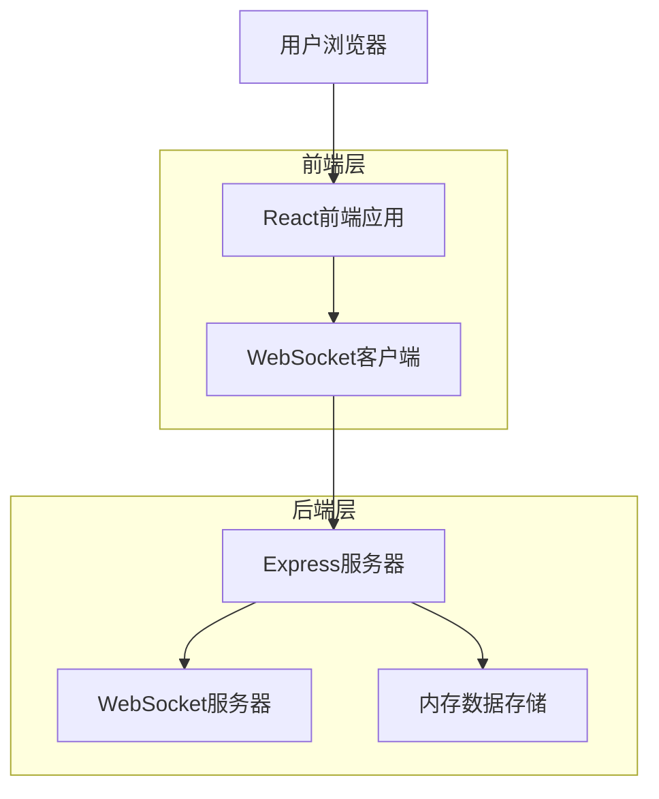
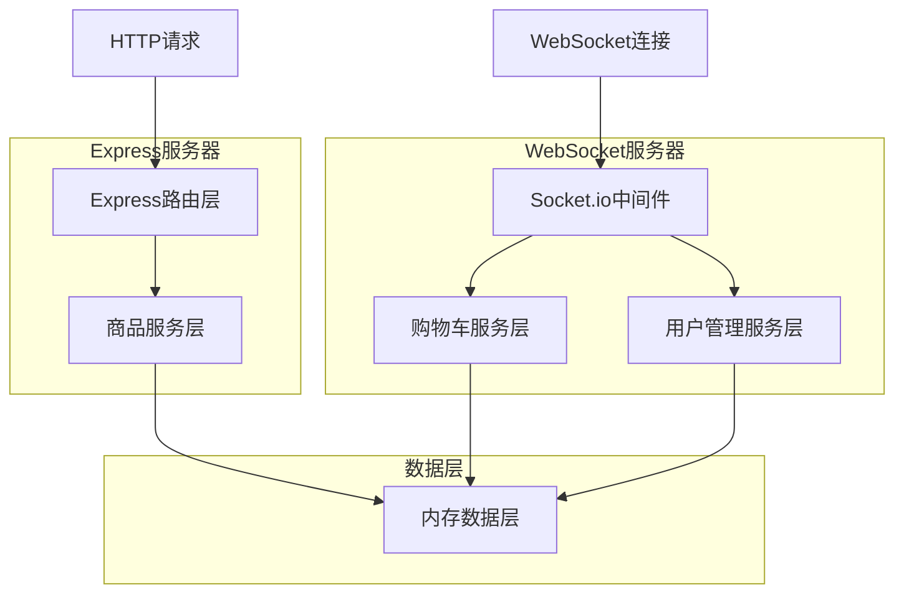
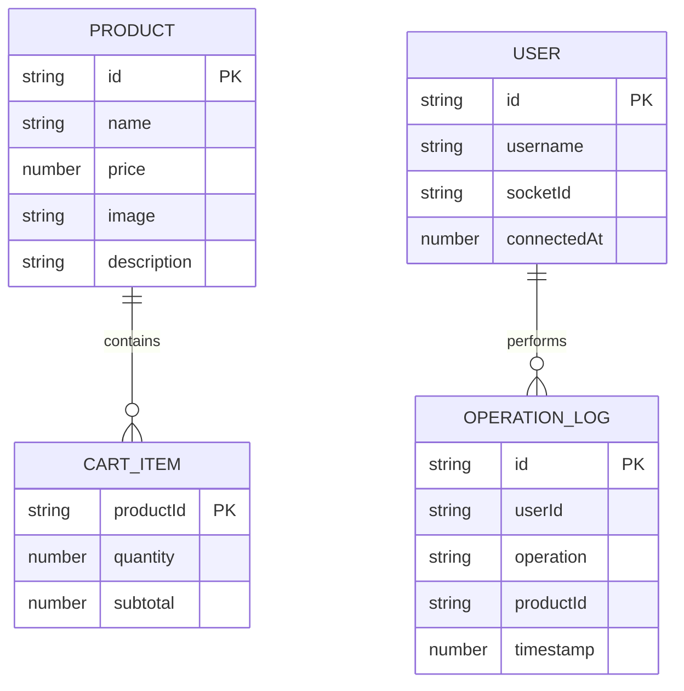

# WebSocket购物车实时同步Demo - 技术架构文档

## 1. Architecture design



## 2. Technology Description

* Frontend: React\@18 + TypeScript + Tailwind CSS + Vite

* Backend: Express\@4 + Socket.io + Node.js

* WebSocket: Socket.io (客户端和服务端)

* 数据存储: 内存存储 (演示用途)

* 开发工具: Vite (前端构建)、Nodemon (后端热重载)

## 3. Route definitions

| Route | Purpose              |
| ----- | -------------------- |
| /     | 首页，显示商品列表和购物车侧边栏     |
| /cart | 购物车详情页面，显示完整的购物车管理界面 |

## 4. API definitions

### 4.1 WebSocket Events

**客户端发送事件**

```typescript
// 添加商品到购物车
interface AddToCartEvent {
  type: 'ADD_TO_CART';
  payload: {
    productId: string;
    quantity: number;
    userId: string;
  };
}

// 更新商品数量
interface UpdateQuantityEvent {
  type: 'UPDATE_QUANTITY';
  payload: {
    productId: string;
    quantity: number;
    userId: string;
  };
}

// 删除商品
interface RemoveFromCartEvent {
  type: 'REMOVE_FROM_CART';
  payload: {
    productId: string;
    userId: string;
  };
}

// 用户连接
interface UserConnectEvent {
  type: 'USER_CONNECT';
  payload: {
    userId: string;
    username: string;
  };
}
```

**服务端广播事件**

```typescript
// 购物车更新
interface CartUpdateEvent {
  type: 'CART_UPDATED';
  payload: {
    cart: CartItem[];
    lastModifiedBy: string;
    timestamp: number;
  };
}

// 用户状态更新
interface UserStatusEvent {
  type: 'USER_STATUS_UPDATE';
  payload: {
    onlineUsers: User[];
    totalCount: number;
  };
}

// 操作通知
interface OperationNotifyEvent {
  type: 'OPERATION_NOTIFY';
  payload: {
    message: string;
    userId: string;
    operation: 'add' | 'update' | 'remove';
    productName: string;
  };
}
```

### 4.2 REST API (辅助接口)

**获取商品列表**

```
GET /api/products
```

Response:

| Param Name | Param Type | Description |
| ---------- | ---------- | ----------- |
| products   | Product\[] | 商品列表        |

**获取当前购物车状态**

```
GET /api/cart
```

Response:

| Param Name   | Param Type  | Description |
| ------------ | ----------- | ----------- |
| cart         | CartItem\[] | 购物车商品列表     |
| totalPrice   | number      | 总价格         |
| lastModified | number      | 最后修改时间戳     |

## 5. Server architecture diagram



## 6. Data model

### 6.1 Data model definition



### 6.2 Data Definition Language

**TypeScript接口定义**

```typescript
// 商品接口
interface Product {
  id: string;
  name: string;
  price: number;
  image: string;
  description: string;
}

// 购物车商品接口
interface CartItem {
  productId: string;
  product: Product;
  quantity: number;
  subtotal: number;
}

// 用户接口
interface User {
  id: string;
  username: string;
  socketId: string;
  connectedAt: number;
}

// 购物车状态接口
interface CartState {
  items: CartItem[];
  totalPrice: number;
  totalItems: number;
  lastModifiedBy: string;
  lastModifiedAt: number;
}

// 操作日志接口
interface OperationLog {
  id: string;
  userId: string;
  operation: 'add' | 'update' | 'remove';
  productId: string;
  productName: string;
  timestamp: number;
  details?: any;
}
```

**内存数据存储结构**

```typescript
// 服务器内存存储
class MemoryStore {
  // 商品数据
  private products: Map<string, Product> = new Map();
  
  // 购物车状态 (全局共享)
  private cartState: CartState = {
    items: [],
    totalPrice: 0,
    totalItems: 0,
    lastModifiedBy: '',
    lastModifiedAt: Date.now()
  };
  
  // 在线用户
  private onlineUsers: Map<string, User> = new Map();
  
  // 操作日志
  private operationLogs: OperationLog[] = [];
}
```

**初始化数据**

```typescript
// 初始商品数据
const initialProducts: Product[] = [
  {
    id: 'p1',
    name: 'iPhone 15 Pro',
    price: 7999,
    image: '/images/iphone15pro.jpg',
    description: '最新款iPhone，支持钛金属机身'
  },
  {
    id: 'p2', 
    name: 'MacBook Air M3',
    price: 8999,
    image: '/images/macbook-air-m3.jpg',
    description: '轻薄便携，性能强劲的笔记本电脑'
  },
  {
    id: 'p3',
    name: 'AirPods Pro',
    price: 1999,
    image: '/images/airpods-pro.jpg', 
    description: '主动降噪无线耳机'
  },
  {
    id: 'p4',
    name: 'iPad Pro 12.9',
    price: 6999,
    image: '/images/ipad-pro.jpg',
    description: '专业级平板电脑，支持Apple Pencil'
  }
];
```

